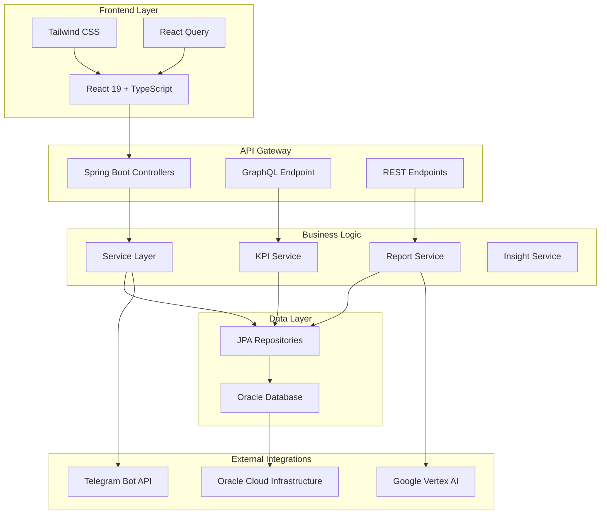

# DashMaster - Enterprise Task Management Platform

<div align="center">


[](https://spring.io/projects/spring-boot)
[](https://reactjs.org/)
[](https://www.oracle.com/database/)
[](LICENSE)

*A comprehensive enterprise-grade task management platform for agile teams*

</div>

## 📋 Table of Contents

- [Overview](#-overview)
- [Features](#-features)
- [Architecture](#-architecture)
- [Technology Stack](#-technology-stack)
- [Getting Started](#-getting-started)
- [API Documentation](#-api-documentation)
- [Deployment](#-deployment)
- [Configuration](#-configuration)
- [Development](#-development)
- [Testing](#-testing)
- [Security](#-security)
- [Performance](#-performance)
- [Contributing](#-contributing)
- [Troubleshooting](#-troubleshooting)
- [License](#-license)

## 🎯 Overview

DashMaster is a modern, enterprise-grade task management platform designed for agile development teams. It provides comprehensive project tracking, team collaboration, sprint management, and advanced analytics through an intuitive web interface and integrated Telegram bot.

### Key Benefits

- **Enhanced Productivity**: Streamlined workflows reduce administrative overhead
- **Real-time Insights**: Advanced KPI dashboards provide actionable intelligence
- **Seamless Integration**: Telegram bot enables mobile task management
- **Scalable Architecture**: Cloud-native design supports enterprise deployment
- **Security First**: JWT authentication with role-based access control

## ✨ Features

### 🔐 Authentication & Security
- **JWT-based authentication** with secure token management
- **Role-based access control** (Manager, Developer, Employee)
- **Session management** with configurable expiration
- **Password encryption** using BCrypt
- **CORS configuration** for secure cross-origin requests

### 📊 Task Management
- **Comprehensive task lifecycle** management (Backlog → In Progress → Done)
- **Smart task estimation** with 4-hour maximum enforcement
- **Priority management** with visual indicators
- **Assignment tracking** with user notifications
- **Time tracking** with actual vs. estimated hours comparison
- **Comment system** for collaboration

### 🏃‍♂️ Sprint Planning
- **Complete sprint lifecycle** (Planning → Active → Completed)
- **Sprint backlog management** with drag-and-drop interface
- **Capacity planning** with team workload visualization
- **Sprint board** with real-time status updates
- **Sprint analytics** with completion metrics

### 👥 Team Management
- **Multi-team organization** with hierarchical structure
- **Manager assignment** with delegation capabilities
- **Team member allocation** across projects
- **Cross-team collaboration** tools
- **Team performance tracking** and reporting

### 📈 Advanced Analytics (KPIs)
- **Real-time dashboards** with customizable metrics
- **Completion rate tracking** with trend analysis
- **Resource utilization monitoring** across teams
- **Burndown charts** for sprint progress
- **Performance benchmarking** between teams and individuals
- **Predictive analytics** for deadline forecasting

### 📋 Intelligent Reporting
- **Custom report generation** with multiple parameters
- **AI-powered insights** using Google Vertex AI integration
- **Export capabilities** (PDF, Excel, CSV)
- **Scheduled reporting** with email delivery
- **Interactive visualizations** with drill-down capabilities

### 🤖 Telegram Bot Integration
- **Task management** via conversational interface
- **Real-time notifications** for task updates
- **Quick task creation** through chat commands
- **Status updates** with progress tracking
- **Team communication** integration

### 🔍 GraphQL API
- **Flexible data querying** with single endpoint
- **Optimized performance** with field-level selection
- **Real-time subscriptions** for live updates
- **Type-safe schema** with comprehensive documentation

## 🏗 Architecture

DashMaster follows a modern **microservices-inspired architecture** with clear separation of concerns:



### Design Principles

- **Domain-Driven Design**: Clear business domain separation
- **SOLID Principles**: Maintainable and extensible codebase
- **Event-Driven Architecture**: Loose coupling between components
- **API-First Design**: Frontend-agnostic backend services
- **Cloud-Native**: Containerized deployment with Kubernetes

## 🛠 Technology Stack

### Backend Technologies

| Component | Technology | Version | Purpose |
|-----------|------------|---------|---------|
| **Framework** | Spring Boot | 3.1.5 | Application framework |
| **Language** | Java | 17 | Primary development language |
| **Security** | Spring Security + JWT | 5.6.2 | Authentication & authorization |
| **Data Access** | Spring Data JPA | 2.6.2 | Database abstraction layer |
| **Database** | Oracle Database | 21c | Primary data store |
| **API Documentation** | SpringDoc OpenAPI | 2.1.0 | Interactive API documentation |
| **GraphQL** | Spring Boot GraphQL | 1.0.0 | Flexible API queries |
| **AI Integration** | Google Vertex AI | 1.21.0 | Intelligent insights |
| **Bot Framework** | Telegram Bots | 6.5.0 | Telegram integration |
| **Testing** | JUnit + Mockito | 5.9.2 | Unit and integration testing |

### Frontend Technologies

| Component | Technology | Version | Purpose |
|-----------|------------|---------|---------|
| **Framework** | React | 19.0.0 | UI framework |
| **Language** | TypeScript | 5.7.2 | Type-safe development |
| **Styling** | Tailwind CSS | 4.0.14 | Utility-first CSS framework |
| **State Management** | React Query | 5.71.5 | Server state management |
| **Routing** | React Router | 7.3.0 | Client-side routing |
| **Form Handling** | React Hook Form | 7.54.2 | Form validation and handling |
| **Charts** | ApexCharts + Recharts | Latest | Data visualization |
| **UI Components** | Radix UI | Latest | Accessible component primitives |
| **Build Tool** | Vite | 6.2.0 | Fast development server |
| **Package Manager** | Bun | 1.x | Fast package management |

### Infrastructure & DevOps

| Component | Technology | Purpose |
|-----------|------------|---------|
| **Containerization** | Docker | Application packaging |
| **Orchestration** | Kubernetes (OKE) | Container orchestration |
| **CI/CD** | Oracle DevOps | Automated deployment |
| **Cloud Platform** | Oracle Cloud Infrastructure | Hosting and services |
| **Web Server** | Nginx | Frontend serving and reverse proxy |
| **Monitoring** | Oracle Observability | Application monitoring |
| **Security Scanning** | OWASP ZAP | Security vulnerability assessment |

## 🚀 Getting Started

### Prerequisites

Ensure you have the following installed:

- **Java 17+** ([Download](https://adoptium.net/))
- **Node.js 20+** ([Download](https://nodejs.org/))
- **Bun** ([Install](https://bun.sh/docs/installation))
- **Docker** ([Download](https://www.docker.com/get-started))
- **Git** ([Download](https://git-scm.com/downloads))

### Quick Start with Docker

1. **Clone the repository**:
   ```bash
   git clone <repository-url>
   cd MtdrSpring
   ```

2. **Configure environment variables**:
   ```bash
   cp .env.example .env
   # Edit .env with your configuration
   ```

3. **Start with Docker Compose**:
   ```bash
   docker-compose up -d
   ```

4. **Access the application**:
   - **Frontend**: http://localhost:3000
   - **Backend API**: http://localhost:8080
   - **Swagger UI**: http://localhost:8080/swagger-ui.html

### Local Development Setup

#### Backend Setup

1. **Navigate to backend directory**:
   ```bash
   cd backend
   ```

2. **Configure database connection** in `application.properties`:
   ```properties
   # Oracle Database Configuration
   spring.datasource.url=jdbc:oracle:thin:@your_connection_string
   spring.datasource.username=${DB_USERNAME:JAVADEV103}
   spring.datasource.password=${DB_PASSWORD:your_password}
   spring.datasource.driver-class-name=oracle.jdbc.OracleDriver
   
   # JWT Configuration
   jwt.secret=${JWT_SECRET:your-secret-key}
   jwt.expiration=${JWT_EXPIRATION:86400000}
   
   # Telegram Bot Configuration (Optional)
   telegram.bot.token=${TELEGRAM_BOT_TOKEN:your-bot-token}
   telegram.bot.name=${TELEGRAM_BOT_NAME:your-bot-name}
   ```

3. **Run the backend**:
   ```bash
   ./mvnw spring-boot:run
   ```

#### Frontend Setup

1. **Navigate to frontend directory**:
   ```bash
   cd frontend
   ```

2. **Install dependencies**:
   ```bash
   bun install
   ```

3. **Configure environment** (`.env.development`):
   ```bash
   VITE_API_BASE_URL=http://localhost:8080
   VITE_AUTH_ENDPOINT=/auth
   VITE_API_ENDPOINT=/api
   ```

4. **Start development server**:
   ```bash
   bun run dev
   ```

### Automated Development Setup

Use the provided script for automatic setup:

```bash
chmod +x start-dev.sh
./start-dev.sh
```

This script will:
- Detect your terminal environment
- Start backend and frontend in separate terminal windows
- Handle environment variable loading
- Provide error handling and logging

## 📖 API Documentation

### REST API Endpoints

#### Authentication Endpoints
```http
POST /auth/login              # User authentication
POST /auth/register           # User registration
```

#### Task Management
```http
GET    /api/tasks             # List all tasks
POST   /api/tasks             # Create new task
GET    /api/tasks/{id}        # Get task by ID
PUT    /api/tasks/{id}        # Update task
DELETE /api/tasks/{id}        # Delete task
POST   /api/tasks/{id}/assign-to-sprint/{sprintId}  # Assign to sprint
POST   /api/tasks/{id}/start?userId={userId}        # Start task
POST   /api/tasks/{id}/complete                     # Complete task
```

#### Sprint Management
```http
GET    /api/sprints           # List all sprints
POST   /api/sprints           # Create new sprint
GET    /api/sprints/{id}      # Get sprint details
PUT    /api/sprints/{id}      # Update sprint
DELETE /api/sprints/{id}      # Delete sprint
POST   /api/sprints/{id}/start    # Start sprint
POST   /api/sprints/{id}/complete # Complete sprint
GET    /api/sprints/{id}/tasks    # Get sprint tasks
```

#### Team Management
```http
GET    /api/teams             # List all teams
POST   /api/teams             # Create new team
GET    /api/teams/{id}        # Get team details
PUT    /api/teams/{id}        # Update team
DELETE /api/teams/{id}        # Delete team
GET    /api/teams/{id}/members          # Get team members
POST   /api/teams/{teamId}/members/{userId}    # Add member
DELETE /api/teams/{teamId}/members/{userId}    # Remove member
POST   /api/teams/{teamId}/manager/{userId}    # Assign manager
```

#### User Management
```http
GET    /api/users             # List all users
POST   /api/users             # Create new user
GET    /api/users/{id}        # Get user details
PUT    /api/users/{id}        # Update user
DELETE /api/users/{id}        # Delete user
GET    /api/users/roles/{role}         # Get users by role
PUT    /api/users/{id}/telegram/{telegramId}  # Update Telegram ID
```

#### KPI & Analytics
```http
GET    /api/kpi/users/{userId}?startDate={date}&endDate={date}   # User KPIs
GET    /api/kpi/teams/{teamId}?startDate={date}&endDate={date}   # Team KPIs
```

#### Reporting
```http
POST   /api/reports/generate        # Generate custom report
GET    /api/reports/sprint-tasks    # Sprint tasks report
```

### GraphQL API

**Endpoint**: `POST /api/graphql`

#### Sample Query - KPI Data
```graphql
query GetKpiData($startSprintId: ID!, $endSprintId: ID) {
  getKpiData(startSprintId: $startSprintId, endSprintId: $endSprintId) {
    data {
      taskCompletionRate
      onTimeCompletionRate
      workedHours
      plannedHours
      hoursUtilizationPercent
    }
    sprintData {
      id
      name
      entries {
        member
        hours
        tasksCompleted
      }
    }
  }
}
```

### Interactive API Documentation

Access comprehensive API documentation at:
- **Swagger UI**: http://localhost:8080/swagger-ui.html
- **GraphQL Playground**: http://localhost:8080/api/graphql

## 🚀 Deployment

### Oracle Cloud Infrastructure (OCI) Deployment

DashMaster is optimized for deployment on Oracle Cloud Infrastructure using:

#### Prerequisites
- OCI Account with appropriate permissions
- Oracle Kubernetes Engine (OKE) cluster
- Oracle Container Registry (OCIR) access
- Oracle Autonomous Database instance

#### Automated Deployment

1. **Configure OCI DevOps Pipeline**:
   ```yaml
   # build_spec.yaml and deploy_spec.yaml are included
   # Configure your OCI DevOps project with these specifications
   ```

2. **Set Environment Variables**:
   ```bash
   export DOCKER_REGISTRY="region.ocir.io"
   export NAMESPACE="your-namespace"
   export OKE_CLUSTER_OCID="ocid1.cluster..."
   export DB_PASSWORD="your-db-password"
   export JWT_SECRET="your-jwt-secret"
   export TELEGRAM_BOT_TOKEN="your-bot-token"
   ```

3. **Deploy to Kubernetes**:
   ```bash
   kubectl apply -f deployment.yaml
   ```

#### Manual Deployment

1. **Build Docker images**:
   ```bash
   # Backend
   cd backend
   docker build -t your-registry/dashmaster-backend:latest .
   
   # Frontend
   cd frontend
   docker build -t your-registry/dashmaster-frontend:latest .
   ```

2. **Push to registry**:
   ```bash
   docker push your-registry/dashmaster-backend:latest
   docker push your-registry/dashmaster-frontend:latest
   ```

3. **Deploy to Kubernetes**:
   ```bash
   kubectl apply -f deployment.yaml
   ```

### Docker Compose Deployment

For development or single-server deployment:

```yaml
version: '3.8'
services:
  backend:
    build: ./backend
    ports:
      - "8080:8080"
    environment:
      - SPRING_DATASOURCE_URL=jdbc:oracle:thin:@database:1521/XEPDB1
      - SPRING_DATASOURCE_USERNAME=dashmaster
      - SPRING_DATASOURCE_PASSWORD=password
    depends_on:
      - database
  
  frontend:
    build: ./frontend
    ports:
      - "3000:3000"
    depends_on:
      - backend
  
  database:
    image: oracle/database:21.3.0-xe
    environment:
      - ORACLE_PWD=password
    ports:
      - "1521:1521"
```

## ⚙️ Configuration

### Environment Variables

#### Backend Configuration
```bash
# Database Configuration
DB_URL=jdbc:oracle:thin:@your_connection_string
DB_USERNAME=your_username
DB_PASSWORD=your_password
DB_DRIVER=oracle.jdbc.OracleDriver

# Security Configuration
JWT_SECRET=your-secure-secret-key
JWT_EXPIRATION=86400000

# Telegram Bot Configuration
TELEGRAM_BOT_TOKEN=your-telegram-bot-token
TELEGRAM_BOT_NAME=your-bot-name

# AI Integration
GEMINI_API_KEY=your-gemini-api-key
GEMINI_PROJECT_ID=your-project-id
GEMINI_LOCATION=us-central1

# Server Configuration
SERVER_PORT=8080
SPRING_PROFILES_ACTIVE=production
```

#### Frontend Configuration
```bash
# API Configuration
VITE_API_BASE_URL=https://your-api-domain.com
VITE_AUTH_ENDPOINT=/auth
VITE_API_ENDPOINT=/api

# Feature Flags
VITE_ENABLE_TELEGRAM_INTEGRATION=true
VITE_ENABLE_AI_INSIGHTS=true
VITE_ENABLE_ANALYTICS=true
```

### Database Configuration

#### Oracle Autonomous Database Setup
```sql
-- Create application user
CREATE USER dashmaster IDENTIFIED BY "SecurePassword123";
GRANT CONNECT, RESOURCE TO dashmaster;
GRANT CREATE SESSION TO dashmaster;
GRANT CREATE TABLE TO dashmaster;
GRANT CREATE SEQUENCE TO dashmaster;
GRANT CREATE VIEW TO dashmaster;

-- Grant additional permissions
ALTER USER dashmaster QUOTA UNLIMITED ON DATA;
```

#### Connection String Format
```properties
spring.datasource.url=jdbc:oracle:thin:@(description=(retry_count=20)(retry_delay=3)(address=(protocol=tcps)(port=1522)(host=your-host))(connect_data=(service_name=your-service))(security=(ssl_server_cert_dn="CN=your-cert")))
```

## 💻 Development

### Code Structure

```
MtdrSpring/
├── backend/                     # Spring Boot backend
│   ├── src/main/java/
│   │   └── com/springboot/MyTodoList/
│   │       ├── controller/      # REST controllers
│   │       ├── service/         # Business logic
│   │       ├── repository/      # Data access layer
│   │       ├── model/           # Entity models
│   │       ├── dto/             # Data transfer objects
│   │       ├── security/        # Security configuration
│   │       ├── config/          # Application configuration
│   │       └── bot/             # Telegram bot integration
│   ├── src/main/resources/      # Configuration files
│   └── src/test/               # Test files
├── frontend/                   # React frontend
│   ├── src/
│   │   ├── components/         # Reusable UI components
│   │   ├── pages/              # Application pages
│   │   ├── services/           # API client services
│   │   ├── hooks/              # Custom React hooks
│   │   ├── contexts/           # React contexts
│   │   └── lib/                # Utility functions
│   ├── public/                 # Static assets
│   └── dist/                   # Build output
├── deployment.yaml             # Kubernetes deployment
├── build_spec.yaml            # OCI build specification
├── deploy_spec.yaml           # OCI deployment specification
└── docker-compose.yml         # Docker Compose configuration
```

### Development Workflow

1. **Feature Development**:
   ```bash
   git checkout -b feature/your-feature-name
   # Develop your feature
   git commit -m "feat: add new feature"
   git push origin feature/your-feature-name
   ```

2. **Code Quality Checks**:
   ```bash
   # Backend tests
   cd backend && ./mvnw test
   
   # Frontend tests and linting
   cd frontend && bun test && bun run lint
   ```

3. **Local Testing**:
   ```bash
   # Start development environment
   ./start-dev.sh
   
   # Run integration tests
   ./run-tests.sh
   ```

### Code Standards

#### Backend (Java)
- Follow **Google Java Style Guide**
- Use **Spring Boot conventions**
- Implement comprehensive **error handling**
- Write **unit tests** for all service methods
- Use **meaningful variable names**
- Apply **SOLID principles**

#### Frontend (TypeScript/React)
- Follow **Airbnb React Style Guide**
- Use **TypeScript strictly** (no `any` types)
- Implement **custom hooks** for reusable logic
- Write **component tests** with React Testing Library
- Use **semantic HTML** for accessibility
- Follow **React best practices**

### API Design Guidelines

1. **RESTful Design**:
   - Use appropriate HTTP methods
   - Follow resource-based URL patterns
   - Implement proper status codes
   - Provide meaningful error messages

2. **GraphQL Design**:
   - Design efficient schemas
   - Implement proper error handling
   - Use data loaders for N+1 prevention
   - Provide comprehensive documentation

3. **Security**:
   - Implement authentication for all endpoints
   - Use role-based authorization
   - Validate all input data
   - Implement rate limiting

## 🧪 Testing

### Backend Testing

#### Unit Tests
```bash
cd backend
./mvnw test
```

#### Integration Tests
```bash
./mvnw test -Dtest="*IntegrationTest"
```

#### Test Coverage
```bash
./mvnw jacoco:report
# View coverage at target/site/jacoco/index.html
```

### Frontend Testing

#### Unit Tests
```bash
cd frontend
bun test
```

#### Component Tests
```bash
bun test --watch
```

#### E2E Tests
```bash
bun run test:e2e
```

### Security Testing

#### OWASP ZAP Scan
```bash
./backend/zap_scan.sh http://localhost:8080
```

#### Dependency Security Scan
```bash
# Backend
./mvnw dependency-check:check

# Frontend
bun audit
```

### Performance Testing

#### Load Testing
```bash
# Using Apache Bench
ab -n 1000 -c 10 http://localhost:8080/api/tasks

# Using wrk
wrk -t12 -c400 -d30s http://localhost:8080/api/tasks
```

## 🔒 Security

### Authentication & Authorization

DashMaster implements a comprehensive security model:

#### JWT Token Security
- **HS256 signing** with configurable secret
- **Configurable expiration** (default: 24 hours)
- **Secure token storage** in HTTP-only cookies
- **Automatic token refresh** for active sessions

#### Role-Based Access Control (RBAC)
```java
@PreAuthorize("hasRole('MANAGER')")
public ResponseEntity<List<Team>> getAllTeams() {
    // Manager-only endpoint
}

@PreAuthorize("hasRole('DEVELOPER') or hasRole('MANAGER')")
public ResponseEntity<List<Task>> getUserTasks() {
    // Developer and Manager access
}
```

#### Security Headers
- **CORS configuration** with whitelist origins
- **CSRF protection** disabled for stateless API
- **Content Security Policy** headers
- **XSS protection** headers

### Data Protection

#### Database Security
- **Connection encryption** with Oracle Wallet
- **Credential management** via environment variables
- **SQL injection prevention** through JPA/Hibernate
- **Data validation** at all input points

#### Sensitive Data Handling
- **Password encryption** using BCrypt
- **API key protection** via environment variables
- **Secure configuration** management
- **Audit logging** for sensitive operations

### Security Best Practices

1. **Regular Security Updates**:
   ```bash
   # Check for vulnerabilities
   ./mvnw dependency-check:check
   bun audit
   ```

2. **Security Scanning**:
   ```bash
   # Run OWASP ZAP scan
   ./backend/zap_scan.sh
   ```

3. **Secure Deployment**:
   - Use HTTPS in production
   - Implement API rate limiting
   - Enable database encryption
   - Regular security audits

## ⚡ Performance

### Backend Optimization

#### Database Performance
- **Connection pooling** with HikariCP
- **Query optimization** with JPA criteria
- **Lazy loading** for entity relationships
- **Database indexing** on frequently queried fields

#### Caching Strategy
```java
@Cacheable(value = "teams", key = "#teamId")
public Team getTeamById(Long teamId) {
    return teamRepository.findById(teamId);
}
```

#### Memory Management
- **Optimized JVM settings**:
  ```bash
  JAVA_OPTS="-Xms256m -Xmx512m -XX:+UseG1GC"
  ```

### Frontend Optimization

#### Bundle Optimization
- **Code splitting** with React.lazy()
- **Tree shaking** for unused code elimination
- **Asset optimization** with Vite
- **Gzip compression** for static assets

#### Performance Monitoring
```typescript
// Performance tracking
const performanceObserver = new PerformanceObserver((list) => {
  list.getEntries().forEach((entry) => {
    console.log(`${entry.name}: ${entry.duration}ms`);
  });
});
```

#### Caching Strategy
- **API response caching** with React Query
- **Browser caching** for static assets
- **Service worker** for offline functionality

### Performance Metrics

#### Target Performance Goals
- **Page load time**: < 2 seconds
- **API response time**: < 500ms (95th percentile)
- **Database query time**: < 100ms (average)
- **Memory usage**: < 512MB (backend)
- **Bundle size**: < 1MB (frontend)

## 🤝 Contributing

### Development Process

1. **Fork the repository**
2. **Create a feature branch**:
   ```bash
   git checkout -b feature/amazing-feature
   ```
3. **Make your changes**
4. **Add comprehensive tests**
5. **Ensure code quality**:
   ```bash
   # Backend
   ./mvnw checkstyle:check
   ./mvnw test
   
   # Frontend
   bun run lint
   bun test
   ```
6. **Commit your changes**:
   ```bash
   git commit -m 'feat: add amazing feature'
   ```
7. **Push to the branch**:
   ```bash
   git push origin feature/amazing-feature
   ```
8. **Open a Pull Request**

### Commit Convention

Follow [Conventional Commits](https://www.conventionalcommits.org/):

- `feat:` New features
- `fix:` Bug fixes
- `docs:` Documentation changes
- `style:` Code style changes
- `refactor:` Code refactoring
- `test:` Test additions or modifications
- `chore:` Maintenance tasks

### Code Review Guidelines

1. **Review Checklist**:
   - [ ] Code follows project style guidelines
   - [ ] Tests are included and passing
   - [ ] Documentation is updated
   - [ ] No security vulnerabilities
   - [ ] Performance impact is considered

2. **Review Process**:
   - All changes require review by at least one team member
   - Automated tests must pass
   - Code quality checks must pass
   - Security scan must complete successfully

## 🔧 Troubleshooting

### Common Issues

#### Database Connection Problems

**Issue**: `Connection refused` errors
```bash
# Check database connectivity
telnet your-database-host 1521

# Verify TNS configuration
tnsping your-service-name

# Check wallet configuration
ls -la src/main/resources/Wallet_javadev/
```

**Solution**:
1. Verify database credentials
2. Check network connectivity
3. Ensure Oracle Wallet is properly configured
4. Validate connection string format

#### Authentication Issues

**Issue**: `401 Unauthorized` responses
```bash
# Check JWT token
curl -H "Authorization: Bearer YOUR_TOKEN" http://localhost:8080/api/tasks
```

**Solution**:
1. Verify JWT secret configuration
2. Check token expiration
3. Ensure proper role assignment
4. Validate CORS settings

#### Performance Issues

**Issue**: Slow API responses
```bash
# Monitor database queries
# Enable JPA query logging
spring.jpa.show-sql=true
spring.jpa.properties.hibernate.format_sql=true
```

**Solution**:
1. Analyze slow queries
2. Add database indexes
3. Implement query optimization
4. Consider caching strategies

#### Frontend Build Issues

**Issue**: Build failures
```bash
# Clear cache and reinstall
rm -rf node_modules
rm bun.lockb
bun install

# Check for dependency conflicts
bun run build --verbose
```

**Solution**:
1. Update dependencies
2. Clear build cache
3. Check TypeScript errors
4. Verify environment variables

### Debugging

#### Backend Debugging
```bash
# Enable debug mode
./mvnw spring-boot:run -Dspring-boot.run.jvmArguments="-Xdebug -Xrunjdwp:transport=dt_socket,server=y,suspend=n,address=5005"
```

#### Frontend Debugging
```bash
# Enable source maps
VITE_BUILD_SOURCEMAP=true bun run build

# Enable verbose logging
DEBUG=true bun run dev
```

### Monitoring & Logging

#### Application Logs
```bash
# View backend logs
tail -f logs/application.log

# View frontend build logs
bun run build --verbose
```

#### Health Checks
```bash
# Backend health
curl http://localhost:8080/actuator/health

# Database connectivity
curl http://localhost:8080/actuator/health/db
```

### Getting Help

If you encounter issues not covered here:

1. **Check the logs** for detailed error messages
2. **Search existing issues** in the repository
3. **Create a detailed issue** with:
   - Environment details
   - Steps to reproduce
   - Expected vs actual behavior
   - Relevant logs or screenshots
4. **Contact the development team** for critical issues

### Emergency Contacts

For production issues:
- **On-call Engineer**: [Daniel Barreras](https://github.com/DanielBrMz)
- **System Administrator**: [Daniel Barreras](https://github.com/DanielBrMz)
- **Database Administrator**: [Daniel Barreras](https://github.com/DanielBrMz)

## 📄 License

This project is proprietary software. All rights reserved.

**Copyright (c) 2024 DashMaster Development Team**

Unauthorized copying, modification, distribution, or use of this software, via any medium, is strictly prohibited without explicit written permission from the copyright holder.

---

<div align="center">

**Built with ❤️ by the DashMaster Team**

</div>